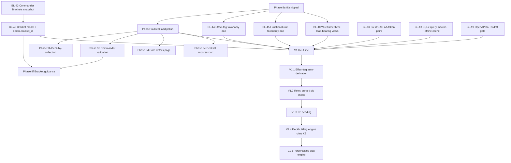

# Tutor — Roadmap

> Living document. Last updated 2026-05-24 after Phase 8 shipped.
> Operational task list lives in `docs/review-2026-05/BACKLOG.md`.
> Decisions log lives in `DECISIONS.md`.
> Project-scoped agent rules live in `.claude/agents/`.

## Vision

Tutor is a local-first MTG collection manager and deckbuilding companion for a single sealed-league / Commander player (multi-user is a post-V1 possibility). It differs from existing tools by treating cards as effects and roles — not just colors and types — and by treating deckbuilding heuristics as **data** the app can cite, not opaque suggestions. V1.0 success looks like: the user can ingest the Scryfall catalog, track multiple physical collections with provenance, and build Commander decks against those collections in a calmly-designed UI they want to use daily.

## Non-goals (for V1.0)

- Not a marketplace, not a price tracker, not a trade-finder.
- Not a real-time multiplayer client and not a playgroup tool.
- No camera scanning (capture or identification) — deferred to V2.0+.
- No LLM-driven card tagging — V1.x uses rules-based derivation.
- No WotC trademarks, color-pip symbols, or card frames (legal posture).
- No hosted deployment in V1 — Docker-based local dev is the contract; hosting choice is deferred.
- No collector-grade per-entry tracking (finish / condition) in the UI — see DECISIONS 2026-05-24 ("Defer collector-grade tracking"). Schema is retained; re-introduction is a pure UI change later.

## Where we are

Phase 8 is shipped end-to-end. The Add Card flow is now a fast, focused, gameplay-first loop (split-pane preview, latest-nonfoil printing default, collector-# rip-the-pack mode, finish/condition removed from UI). CI runs the SQLx integration tests against a real Postgres service. The next user-visible cut is to drag the same UX standard across the **deck-building** loop, then close out the remaining V1.0 contract gaps (taxonomy seed, bracket model, accessibility).

## Shipped phases

| Phase | Title | Status | Commit | What landed |
|-------|-------|--------|--------|-------------|
| 1 | Brand foundations | Done | `eba8cc7`, `dd5dc24` | Three brand directions seeded; Direction C ("Field Manual") finalized with tokens and brief |
| 2 | Scaffold | Done | `d1f4bf3` | Rust API (Axum + SQLx + utoipa) + plain React web (Vite + TS) + Docker Postgres on port 55432 |
| 3 | Schema | Done | `c557783` | Card catalog, collections, decks, taxonomy tables (oracle/printing split, m:n tagging with `source`) |
| 4 | Scryfall ingest | Done | `bc4127b` | Bulk-data sync pipeline for sets, oracle cards, printings; `GET /api/health` row counts |
| 5 | Card browse | Done | `c4626f3` | Card browse + detail views against the ingested catalog |
| 6 | Collections | Done | `4a040f0` | Collections CRUD + entries with provenance (pack/buy/trade + date + notes) |
| 7 | Decks | Done | `be30bd3` | Decks CRUD + entries with zones (main/side) |
| 8a | Card picker autocomplete | Done | `666dd7d` | Typeahead combobox + `set:` token + smart defaults on collections add form |
| 8b | Browse per collection | Done | `de84332` | `/cards/search` extended with `collection_id` + `grouping`; reusable `CardBrowser`, two-tab `CollectionDetail` |
| 8c | Split-pane CardPicker + Preview | Done | `2310a60` | Persistent CardPreview right pane; picker selection persists across adds |
| 8d | Collector-# add mode + defaults | Done | `51a7f8b` | Set-picker + collector-# mode; latest-nonfoil printing default; inline picker results |
| 8e | TDZ fix + two-column preview | Done | `e6fbb77` | Collector-# TDZ crash fixed; CardPreview reflowed image-left / form-right |
| 8f | Add Card visual repair | Done | `6c9269a` | Label spacing, empty states, mode-aware helper copy |
| 8g | Collector # inline add row | Done | `7b9a849` | Single inline row for true rip-the-pack cadence |
| 8h | Truncate long set names | Done | `ec021dc` | Long product names truncated in PRINTING `<select>` |
| 8i | Drop finish/condition from UI | Done | `3f62de0` | Add Card UI focused on gameplay; finish=nonfoil + condition=near_mint sent silently |
| 8j | CI hygiene | Done | `7d387d7`, `7de11a4` | rustfmt drift fixed; Postgres service added to Rust CI so `#[sqlx::test]` actually runs |

## V1.0 cut line

Every V1.0 capability locked in `DECISIONS.md` (2026-05-24 entry "V1 scope") and the `tutor-pm` agent definition. Status: ✅ done · 🟡 partial · ⏳ pending · 🚫 cancelled.

| Capability | Status | Backed by |
|---|---|---|
| Brand identity (tokens, palette, type, voice) | 🟡 | Phase 1; 4 token pairs fail WCAG AA (BL-31), logo + favicon + PWA manifest missing (BL-32), focus-visible global (BL-34), self-hosted fonts decision (BL-36) |
| Full data model present (cards, printings, collections, decks, taxonomy, KB, personality, bracket) | 🟡 | Phase 3; bracket tables missing (BL-46), KB rules table missing (BL-56), archetype catalog missing (BL-55), normalised mana cost (BL-49), normalised type line (BL-50), derived flags (BL-51), format catalog (BL-52), card relationships / all_parts (BL-54) |
| Scryfall integration (live API + bulk sync + image cache) | 🟡 | Phase 4; `game_changer` not ingested (BL-47), missing fields (BL-48), legalities provenance (BL-53), Scryfall attribution UI surface (BL-33) |
| Collections CRUD with acquisition tracking | ✅ | Phase 6 |
| Card entry — name search + autocomplete | ✅ | Phase 8a/8c (split-pane combobox over `/cards/search`) |
| Card entry — set + collector number | ✅ | Phase 8d/8g (collector-# mode; inline rip-the-pack row) |
| Card entry — paste-list bulk import | ⏳ | Format decision required before code (BL-10) |
| Decks CRUD (name, format, bracket, main/side, role) | 🟡 | Phase 7 ships name/format/main/side; `bracket_id` requires bracket model (BL-46); per-deck role field needs functional-role taxonomy (BL-45) |
| Card gallery + deck views polished | 🟡 | Phase 5/7/8 ship usable views; deck add UX has not yet received the Phase 8 treatment (see Phase 9a); load-bearing wireframes pending (BL-40), badge primitives missing (BL-38), shadcn/ui canonical primitives (BL-39), state library (BL-72), error boundaries (BL-70) |
| Light/dark themes from brand tokens | ⏳ | Theme toggle backed by `data-theme` + `localStorage` (BL-71) |
| One-command local dev | ✅ | `scripts/dev.sh` + `make dev` (`418e750`) |
| Effect-tag taxonomy populated | ⏳ | Spec document + seed SQL (BL-44); auto-derivation is V1.1, taxonomy doc + minimal seed are V1.0 |
| Functional-role taxonomy populated | ⏳ | Spec + role-vs-tag semantics (BL-45) |
| Bracket model (Commander Brackets snapshot + decks.bracket_id) | ⏳ | BL-43 (snapshot), BL-46 (tables + decks FK) |
| Mana symbol display | ⏳ | WUBRG tokens + `<Mana>` component (BL-37) |
| Compile-time-safe SQLx (`query!`/`query_as!` + offline cache) | ⏳ | BL-13 |
| Structured `ApiError` payload + per-route OpenAPI error responses | ⏳ | BL-14, BL-22 |
| Axum hardening (CORS, request-id, timeout, body-size, compression) | ⏳ | BL-15 |
| OpenAPI ↔ TS drift gate in CI | ⏳ | BL-19 |
| Rust integration tests via `#[sqlx::test]` verified in CI | ✅ | Phase 8j (`7de11a4`) |
| Supply-chain CI (`cargo deny`, `cargo audit`, `pnpm audit`) | ⏳ | BL-18 |
| Playwright smoke wired to CI compose | ⏳ | BL-30 |
| WCAG AA contrast across tokens + verification harness | ⏳ | BL-31, BL-35 |

## Phase 9 candidates (ranked)

Product-direction signal from Phase 8i is clear: optimise for deckbuilding and gameplay, not collection grading. That weights deck-side work over collection-status work. Ranked candidates:

| Rank | Phase | Title | Rationale |
|---:|---|---|---|
| 1 | **9a** | **Deck add flow polish** | Apply Phase 8 UX patterns (split-pane, persistent preview, latest-nonfoil default, after-submit refocus) to the deck-entry form. This is the single highest-leverage UX win because deck-building is now the primary loop and the current deck-add form is the old linear pattern that Phase 8 just replaced for collections. Recommended default. |
| 2 | 9b | Deck list per collection | "Which decks pull from this collection?" inverse view on the CollectionDetail page. Natural follow-up to 9a; reuses the entry-aggregation pattern from Phase 8b. Small surface, high information density. |
| 3 | 9c | Commander format validation | Color-identity check vs commander, 100-card sum, singleton enforcement, format banlist surface. First "rule-cite" feature — sets the precedent for Phase V1.4's deckbuilding engine. Requires `tutor-mtg-expert` to source the banlist + color-identity rule text. |
| 4 | 9d | Card details page | First-class `/cards/:oracle_id` page with all printings (versioned by set + released_at), rulings, and reverse links ("decks that play this", "collections that own this"). Currently the card-preview panel is the only way to see a card; a permalinkable page is overdue. |
| 5 | 9e | Decklist import/export | Arena/MTGO text format both directions. Closes the BL-10 paste-list bulk import for the deck surface, and unblocks the most common "I built this elsewhere" import flow. |
| 6 | 9f | Bracket / power level guidance | Surface the WotC Commander Brackets framework. Requires bracket model (BL-46) and `tutor-mtg-expert` to confirm the rule snapshot. Probably depends on 9c shipping first because both engage the rules-citation pattern. |

**Recommendation: Phase 9a.** It is the smallest, lowest-risk option, has zero new domain dependencies, and directly carries the Phase 8i product-direction signal forward. Everything else can run in parallel or follow.

## V1.x — themes, not commitments

Sequence and intent come from the `DECISIONS.md` V1 scope entry and the `tutor-pm` agent definition. Each is a theme with backlog clusters, not a commitment to a sprint:

- **V1.1 — Effect-tag auto-derivation.** Rules-based tagger over oracle text + Scryfall keywords. Depends on BL-44 (taxonomy doc) landing in V1.0 and BL-47 / BL-48 (full Scryfall surface) being ingested.
- **V1.2 — Role / curve / pip charts.** Visual analytics for a deck's role mix, mana curve, and pip distribution. Hard-depends on BL-49 (normalised mana cost) and BL-45 (functional-role taxonomy).
- **V1.3 — Knowledge base seeding.** Populate `kb_rules` (BL-56) from web research with `source_url` + `fetched_on`. Drives the "cite the rule" UX in V1.4.
- **V1.4 — Deckbuilding engine that cites KB rules.** Archetype templates + role-ratio guidance (BL-55) consume the KB. The engine surfaces *which* rule motivated each recommendation.
- **V1.5 — Personalities engaged in recommendations.** Selectable advisor profiles (Spike, Brewer, Budget, Combo, Synergy) bias the V1.4 engine. Schema is already in place; this is the UX + bias-weighting layer.
- **V2.0+ — Camera scanning.** Capture (V2.0) then identification (V2.1) as separable phases. Highest-risk feature in the original brief; punted for that reason.
- **Later — Multi-user / playgroup, optional LLM tagging, mobile PWA polish, collector-grade per-entry tracking (finish/condition).**

## Sequencing (phase-level DAG)

## How this document is maintained

- Owner: `tutor-pm` agent.
- Update cadence: after every phase merges to `main`; after every backlog re-prioritization.
- Status emojis: ✅ done · 🟡 partial · ⏳ pending · 🚫 cancelled.
- New phases must land here BEFORE first commit on the phase branch.
- Per-phase one-pagers live in `docs/phases/` once BL-06 ships the template; this doc links to them but does not duplicate them.

## Pointers

- Backlog (operational task list): `docs/review-2026-05/BACKLOG.md`
- Decisions log: `DECISIONS.md`
- Audit reports (the WHY behind the backlog): `docs/review-2026-05/audit/`
- Brand brief: `branding/brief.md`
- Agent definitions: `.claude/agents/`
