# Tutor — Project Review Backlog

> Generated 2026-05-24 from 5 parallel audits (PM, Engineering, MTG, Brand, Agents).
> Solo dev + Claude-agents context. Items numbered BL-NN, prioritized globally P0 -> P3.

## How to use this backlog

**Top-down for sprint planning.** Read the Cluster Map and the "Suggested Phase-5 Sprint" section first. Those two tables tell you what to pick up next week and why. Every P0 item is either a Phase-5 entry-gate or a contract-fidelity bug (a written promise the codebase doesn't actually keep). Knock out P0s before any new feature code lands.

**Per-cluster for focused work.** When you're in "Engineering Hardening" mode, read Cluster 2 end-to-end and ignore the others. Items inside a cluster are pre-sorted by priority and respect their declared dependencies. The dependency graph at the top shows the cross-cluster prerequisites (e.g., `BL-13` typed errors must land before `BL-15` per-route error responses make sense). Anything marked "Depends on: none" is a clean pickup with no upstream work required.

## Cluster Map (at-a-glance)

| Cluster | P0 | P1 | P2 | P3 | Total |
|---|---:|---:|---:|---:|---:|
| 1. Foundation Hygiene | 4 | 5 | 2 | 1 | 12 |
| 2. Engineering Hardening | 4 | 7 | 5 | 3 | 19 |
| 3. Brand & Design System | 6 | 6 | 2 | 0 | 14 |
| 4. MTG Domain Content | 4 | 8 | 3 | 1 | 16 |
| 5. Agent / Tooling Infrastructure | 0 | 5 | 5 | 1 | 11 |
| **Totals** | **18** | **31** | **17** | **6** | **72** |

## Suggested Phase-5 Sprint (top 12)

If you have one focused sprint, these are the items that pay back the most against the audit findings. Mix of "fix the broken contract" and "unblock the next phase":

1. **BL-01** — Add project-scoped `CLAUDE.md`. Single highest-leverage agent fix; current sessions inherit irrelevant TypeScript rules.
2. **BL-02** — Add `ROADMAP.md` + write Phase-5 plan with acceptance criteria. The "plan -> approval -> implement -> verify" loop has no plan artifact today.
3. **BL-03** — Backfill acceptance criteria + closure entries for Phases 1-4. Makes "is Phase 3 done?" answerable without re-reading code.
4. **BL-04** — Add `.claude/settings.json` permission allow-list (`cargo|pnpm|sqlx|make|docker compose`). Removes dozens-per-session prompts.
5. **BL-05** — Verify CI Rust job actually runs `#[sqlx::test]` integration tests (likely silently skipped today — no `services: postgres` block).
6. **BL-13** — Adopt `sqlx::query!` macros + check in `.sqlx/` offline cache. The whole reason SQLx was chosen; currently zero macros and `SQLX_OFFLINE=true` is a no-op.
7. **BL-14** — Structured `ApiError` payload (`code`, `message`, `request_id`). Every server error is currently the literal string `"internal error"`.
8. **BL-15** — Axum hardening middleware (CORS, request-id, timeout, body-size, compression). Trivial now, painful later.
9. **BL-31** — Fix the four sub-WCAG-AA token pairs in `branding/tokens.css`. Written promise is currently false.
10. **BL-32** — Ship `branding/logo.svg` + favicon set. App opens to default Vite icon today.
11. **BL-39** — Initialize shadcn/ui + scaffold canonical primitives. Committed in DECISIONS.md, not done; Phase-5 UI will be hand-rolled without it.
12. **BL-44** — Author Effect-Tag + Functional-Role taxonomy spec docs (markdown, before seed SQL). Phase 6 tagger blocked without this.

Items 1-5 are the "morning of day 1" pickups (all S effort, all unblock other items). Items 6-12 are deeper but each is independently shippable.

## Dependency Graph (Mermaid)

```mermaid
flowchart LR
  %% Foundation Hygiene
  BL-01[BL-01 project CLAUDE.md] --> BL-04[BL-04 settings.json allow-list]
  BL-01 --> BL-07[BL-07 agent tools/model]
  BL-01 --> BL-11[BL-11 disable/repoint qmd]
  BL-02[BL-02 ROADMAP.md] --> BL-05[BL-05 Phase-5 plan]
  BL-02 --> BL-08[BL-08 V1.0 cut line]
  BL-02 --> BL-12[BL-12 README status block]
  BL-03[BL-03 backfill P1-P4 closure] --> BL-06[BL-06 docs/phases template]
  BL-05 --> BL-10[BL-10 bulk-import format decision]
  BL-05 --> BL-40[BL-40 wireframes]

  %% Engineering Hardening
  BL-16[BL-16 CI postgres service] --> BL-13[BL-13 sqlx::query! macros]
  BL-14[BL-14 typed ApiError] --> BL-15[BL-15 hardening middleware]
  BL-14 --> BL-22[BL-22 per-route error responses]
  BL-15 --> BL-17[BL-17 axum HTTP integration tests]
  BL-20[BL-20 Config + --dump-openapi] --> BL-19[BL-19 CI codegen+diff]
  BL-19 --> BL-23[BL-23 openapi-fetch client]
  BL-20 --> BL-27[BL-27 multi-stage Dockerfile]
  BL-32 --> BL-30[BL-30 Playwright smoke test]
  BL-70[BL-70 FE error boundary] -.-> BL-72

  %% Brand & Design
  BL-31[BL-31 fix WCAG tokens] --> BL-39[BL-39 shadcn/ui init]
  BL-31 --> BL-34[BL-34 :focus-visible]
  BL-31 --> BL-35[BL-35 contrast harness]
  BL-32[BL-32 logo+favicon] --> BL-33[BL-33 Scryfall attribution]
  BL-39 --> BL-37[BL-37 Mana component]
  BL-39 --> BL-38[BL-38 badge primitives]
  BL-39 --> BL-41[BL-41 /_dev/tokens]
  BL-39 --> BL-42[BL-42 z-index + spacing aliases]
  BL-39 --> BL-72[BL-72 empty/loading/error states]

  %% MTG Domain
  BL-43[BL-43 KB snapshots] --> BL-44[BL-44 effect-tag spec]
  BL-43 --> BL-45[BL-45 role spec]
  BL-43 --> BL-46[BL-46 bracket modeling]
  BL-46 --> BL-47[BL-47 game_changer ingest]
  BL-50[BL-50 type line normalisation] --> BL-51[BL-51 derived flags]
  BL-48[BL-48 reserved/all_parts/games ingest] --> BL-54[BL-54 card_relationships]
  BL-21[BL-21 typed Legalities] --> BL-53[BL-53 legalities_fetched_at]
  BL-45 --> BL-55[BL-55 archetype catalog]
  BL-52[BL-52 format catalog] --> BL-55

  %% Agent / Tooling
  BL-01 --> BL-59[BL-59 tutor-decision-log]
  BL-01 --> BL-60[BL-60 tutor-scryfall-fetch]
  BL-01 --> BL-66[BL-66 tutor-qa responsibility]
  BL-01 --> BL-67[BL-67 ownership ambiguities]
  BL-01 --> BL-69[BL-69 .claude/hooks/]
  BL-06 --> BL-61[BL-61 tutor-phase-handoff]
  BL-59 --> BL-61
  BL-19 --> BL-62[BL-62 tutor-openapi-sync]
  BL-35 --> BL-64[BL-64 tutor-token-audit]
  BL-02 --> BL-68[BL-68 PHASES status file]

  %% New Phase-5 UX pair
  BL-71[BL-71 theme toggle data-theme]
```

---

## Backlog (Full)

## Cluster 1 — Foundation Hygiene

### BL-01 — Add project-scoped `CLAUDE.md` for Tutor
- **Cluster:** Foundation Hygiene
- **Priority:** P0
- **Lens(es):** Agents, PM
- **Owner agent:** tutor-pm
- **Effort:** S
- **Depends on:** none
- **Why:** Tutor currently inherits ~600 lines of WalletConnect/TypeScript guidance from parent `CLAUDE.md`/`PROJECT_AGENTS.md` that have no Rust analog (`handlePromise`, `osAuth.middleware`, optimistic-update rollback). Agents have to mentally subtract those rules. Single highest-leverage missing artifact.
- **Definition of done:**
  - `/home/mantis/Development/mantis-dev/tutor/CLAUDE.md` exists at project root.
  - Declares stack: Rust + Axum + SQLx + Postgres + plain React + Vite + Tailwind.
  - Commit format documented: `feat|fix|chore|spec(<scope>): Phase N — ...`.
  - `DECISIONS.md` entry shape documented (date / decision / reason / alternatives / who).
  - "Never reuse WotC IP" guardrail listed (Planeswalker, mana glyphs, frame art).
  - Explicitly states parent's TypeScript-specific patterns do NOT apply to Rust API.
- **Source:** audit 005 §9.1, §4

### BL-02 — Add `ROADMAP.md` at project root
- **Cluster:** Foundation Hygiene
- **Priority:** P0
- **Lens(es):** PM
- **Owner agent:** tutor-pm
- **Effort:** S
- **Depends on:** none
- **Why:** Roadmap currently lives in three half-overlapping places (agent prompt, `DECISIONS.md`, commit history). No single source of truth for phase sequence + status. Worked for Phases 1-4; will not scale past V1.0 where dependencies tangle (tagging -> charts -> KB -> engine).
- **Definition of done:**
  - `ROADMAP.md` at repo root with phase table (status column).
  - Maps each remaining V1 scope item to a phase.
  - Phase 5-7 sequence committed; V1.1-V1.5 documented as roadmap, not commitment.
- **Source:** audit 001 §1, §7.1

### BL-03 — Backfill acceptance criteria + closure entries for Phases 1-4
- **Cluster:** Foundation Hygiene
- **Priority:** P0
- **Lens(es):** PM
- **Owner agent:** tutor-pm
- **Effort:** S
- **Depends on:** none
- **Why:** Charter mandates "testable bullets before any code is written" and "sign off before merging phase work" — zero acceptance criteria documents on disk, zero sign-off records. Makes "is Phase 3 really done?" require re-deriving criteria from migrations + DECISIONS.
- **Definition of done:**
  - One closure doc per phase (or appended to `DECISIONS.md` as "Phase N closed" entries).
  - Each lists acceptance criteria met, deferred items, known gaps.
  - Phase 4 entry references `GET /api/health` row-counts as the implicit acceptance probe.
- **Source:** audit 001 §3, §7.3

### BL-04 — Add `.claude/settings.json` permission allow-list
- **Cluster:** Foundation Hygiene
- **Priority:** P0
- **Lens(es):** Agents
- **Owner agent:** tutor-engineer
- **Effort:** S
- **Depends on:** BL-01
- **Why:** Every Bash invocation currently triggers a permission prompt. For a project using `cargo`, `pnpm`, `sqlx`, `docker compose`, `make` constantly, this trains users to "allow always" reflexively. Real UX tax and a soft security risk.
- **Definition of done:**
  - `.claude/settings.json` pre-allows: `cargo build|test|fmt|clippy|run`, `pnpm dev|build|test|lint|typecheck`, `sqlx migrate *`, `make *`, `docker compose ps|logs|up|down`, `git status|diff|log|add|commit`.
  - Destructive operations (`git push --force`, `cargo install`) remain prompt-gated.
- **Source:** audit 005 §9.3, §2

### BL-05 — Write Phase-5 plan before any code lands
- **Cluster:** Foundation Hygiene
- **Priority:** P1
- **Lens(es):** PM
- **Owner agent:** tutor-pm
- **Effort:** S
- **Depends on:** BL-02
- **Why:** Phase 5 is the first phase where what-to-build is genuinely ambiguous (collections CRUD vs. card entry vs. minimal UI shell). Without a written plan, the charter's "plan -> approval -> implement" loop breaks. Branch `phase-5-card-browse` already has uncommitted work — risk of scope drift right now.
- **Definition of done:**
  - `docs/phases/phase-5.md` (or equivalent) with: objectives, deliverables, acceptance criteria, agent assignments, risks, dependencies.
  - PM signs off; user approves before implementation continues.
  - Plan explicitly chooses between "collections + entry first" vs. "browse-only first" with rationale.
- **Source:** audit 001 §7.2, §4

### BL-06 — Create `docs/phases/` with a one-pager-per-phase template
- **Cluster:** Foundation Hygiene
- **Priority:** P1
- **Lens(es):** PM
- **Owner agent:** tutor-pm
- **Effort:** M
- **Depends on:** BL-03
- **Why:** Forces the discipline going forward. Charter promises it; no artifact survives. Template-driven approach prevents per-phase ad-hoc structure.
- **Definition of done:**
  - `docs/phases/_template.md` with: objectives, deliverables (checklist), acceptance criteria (testable bullets), agent assignments, risks + mitigations, status.
  - Phases 1-4 closure docs (BL-03) re-formatted to template if needed.
- **Source:** audit 001 §7.4

### BL-07 — Add `tools:` and `model:` to each agent's frontmatter
- **Cluster:** Foundation Hygiene
- **Priority:** P1
- **Lens(es):** Agents
- **Owner agent:** tutor-pm
- **Effort:** S
- **Depends on:** BL-01
- **Why:** Every agent inherits the full tool surface. `tutor-mtg-expert` and `tutor-brand-design` don't need Bash; `tutor-engineer` rarely needs WebFetch. Scoping reduces accidental capability and signals each agent's role.
- **Definition of done:**
  - `tutor-mtg-expert`: `tools: Read, WebFetch, WebSearch, Grep, Glob`.
  - `tutor-brand-design`: `tools: Read, Write, Edit, Grep, Glob, WebFetch`.
  - `tutor-pm`: `tools: Read, Edit, Grep, Glob`.
  - `tutor-engineer`: full surface.
  - `model:` per agent based on cost vs. capability needs (pm/brand can likely run on a smaller model).
- **Source:** audit 005 §9.2, §1

### BL-08 — Define V1.0 cut line explicitly (which phases ship which features)
- **Cluster:** Foundation Hygiene
- **Priority:** P1
- **Lens(es):** PM
- **Owner agent:** tutor-pm
- **Effort:** S
- **Depends on:** BL-02
- **Why:** V1.0 contains "collections CRUD, card entry, decks CRUD, gallery, deck views, theming" — but not which phase ships which. Likely 3 phases (5: Collections+Entry, 6: Decks, 7: Gallery/Polish/Theme), but unconfirmed. Without explicit mapping, Phase 5 may try to do too much.
- **Definition of done:**
  - In `ROADMAP.md`, every V1.0 feature is annotated with target phase.
  - Phase 5-7 deliverables are mutually exclusive and collectively exhaustive of V1.0.
- **Source:** audit 001 §7.5

### BL-09 — Backfill missing decisions in `DECISIONS.md`
- **Cluster:** Foundation Hygiene
- **Priority:** P2
- **Lens(es):** PM
- **Owner agent:** tutor-pm
- **Effort:** S
- **Depends on:** none
- **Why:** Several non-obvious choices lack rationale: `openapi-typescript` over `orval`/`openapi-fetch`/`kubb`, Postgres port 55432, `default_cards` vs `all_cards` ingest, `Cargo.lock` tracked, premature schema columns (`affects_board_on_cast`, `fetchable_land_types`).
- **Definition of done:**
  - 5+ new dated entries in `DECISIONS.md` covering the above.
  - Each 2-4 lines: decision + reason + alternatives.
- **Source:** audit 001 §2, §7.7

### BL-10 — Decide bulk-import format(s) before Phase 5 starts
- **Cluster:** Foundation Hygiene
- **Priority:** P1
- **Lens(es):** PM, MTG
- **Owner agent:** multi (tutor-pm + tutor-mtg-expert)
- **Effort:** S
- **Depends on:** BL-05
- **Why:** "Paste-list bulk import" is in V1 scope but format is unspecified. MTGO `.dec`? Arena `.txt`? Tappedout? Plain names? Names + set + collector number? Affects parser complexity, error UX, and round-trip fidelity.
- **Definition of done:**
  - Decision logged in `DECISIONS.md` naming the formats to support in V1 vs. defer.
  - At least one MTG-correct example per supported format committed as a test fixture.
- **Source:** audit 001 §7.10

### BL-11 — Disable or repoint the `qmd` MCP server for this project
- **Cluster:** Foundation Hygiene
- **Priority:** P2
- **Lens(es):** Agents
- **Owner agent:** tutor-engineer
- **Effort:** S
- **Depends on:** BL-01
- **Why:** `qmd` is configured for WalletConnect collections (`kb`, `scopes`, `kb-archive`, `research`) — none about Tutor. Contributes only noise to Tutor sessions.
- **Definition of done:**
  - Either removed from `enabledMcpjsonServers` in `.claude/settings.local.json`, OR
  - Tutor-scoped qmd index stood up over `DECISIONS.md` + `branding/brief.md` + future `kb/`.
- **Source:** audit 005 §9.15, §2

### BL-12 — Top-of-README status block + dogfooding milestones
- **Cluster:** Foundation Hygiene
- **Priority:** P3
- **Lens(es):** PM
- **Owner agent:** tutor-pm
- **Effort:** S
- **Depends on:** BL-02
- **Why:** Current README still says "Phase 2 scaffold" — stale. Single status line plus dogfooding milestones tied to phase exits (P5: user enters real sealed pool; P6: builds Commander deck against pool; P7: UI calm enough for daily use) anchor phase definitions to user outcomes.
- **Definition of done:**
  - README opens with current-phase / next-phase status block.
  - Dogfooding milestones documented in `ROADMAP.md` or `docs/phases/`.
- **Source:** audit 001 §7.11, §7.12

---

## Cluster 2 — Engineering Hardening

### BL-13 — Adopt `sqlx::query!`/`query_as!` macros + check in `.sqlx/` offline cache
- **Cluster:** Engineering Hardening
- **Priority:** P0
- **Lens(es):** Engineering
- **Owner agent:** tutor-engineer
- **Effort:** M
- **Depends on:** BL-05
- **Why:** The whole reason SQLx was chosen over Diesel. Today every query in `routes/cards.rs`, `health.rs`, `sets.rs`, `scryfall/import.rs` is runtime `sqlx::query(...)` — a column rename or type drift only surfaces at HTTP call time. `SQLX_OFFLINE=true` in CI is a no-op with no `.sqlx/` cache. Highest-leverage tech debt to address before Phase 5 grows.
- **Definition of done:**
  - ~20 runtime queries migrated to `sqlx::query!` / `sqlx::query_as!`.
  - `cargo sqlx prepare --workspace` run; `.sqlx/` committed.
  - CI `SQLX_OFFLINE=true` actually consumes the cache.
  - `cargo check` becomes a schema regression test for free.
- **Source:** audit 002 §2.1, §10.1, R1

### BL-14 — Structured `ApiError` payload (code, message, request_id, variants)
- **Cluster:** Engineering Hardening
- **Priority:** P0
- **Lens(es):** Engineering
- **Owner agent:** tutor-engineer
- **Effort:** S
- **Depends on:** none
- **Why:** `ApiError::Database` and `ApiError::Other` both return the literal `"internal error"` with status 500. Hard to debug; FE can't surface "duplicate entry" vs "validation failed" vs "server bug". Phase 5 mutations (`POST /collections`) will surface this gap immediately.
- **Definition of done:**
  - `ApiError` variants: `NotFound`, `BadRequest { code, field_errors }`, `Conflict`, `UnprocessableEntity`, `Internal`.
  - Wire shape: `{ code, message, request_id, details? }`.
  - SQLx unique-violation errors auto-mapped to `Conflict`.
  - Registered as `utoipa` schema and referenced from at least one handler.
- **Source:** audit 002 §2.2, §10.2, R2

### BL-15 — Axum hardening middleware (CORS, request-id, timeout, body-size, compression)
- **Cluster:** Engineering Hardening
- **Priority:** P0
- **Lens(es):** Engineering
- **Owner agent:** tutor-engineer
- **Effort:** S
- **Depends on:** BL-14
- **Why:** `tower-http` features are pulled in (`compression-gzip`) but no layers applied. The moment FE is on Cloudflare Pages and API on Fly.io, CORS will break browser requests. A single slow Postgres query will hold a Tokio task forever. Trivial now, painful at Phase 7.
- **Definition of done:**
  - `CorsLayer::new().allow_origin(...)` configured (dev: `*`, prod: from `Config`).
  - `RequestIdLayer` + `PropagateRequestIdLayer` (wires to BL-14).
  - `TimeoutLayer` with sensible default (e.g., 30s).
  - `RequestBodyLimitLayer` (e.g., 2MB default).
  - `CompressionLayer::gzip()`.
- **Source:** audit 002 §2.3, §10.8, R3

### BL-16 — Verify CI Rust job actually runs `#[sqlx::test]` integration tests
- **Cluster:** Engineering Hardening
- **Priority:** P0
- **Lens(es):** Engineering
- **Owner agent:** tutor-engineer
- **Effort:** S
- **Depends on:** none
- **Why:** CI `.github/workflows/ci.yml` has no `services: postgres` block and no `DATABASE_URL` env. Most likely the `#[sqlx::test]` integration tests are silently skipped/not running. **Single most important CI gap** — silently green CI since Phase 3.
- **Definition of done:**
  - Inspect recent CI run logs to confirm whether ingest_fixtures.rs tests ran.
  - If not: add `services: postgres: image: postgres:16-alpine` block + `DATABASE_URL` env.
  - All `#[sqlx::test]` tests verifiably execute on every PR.
- **Source:** audit 002 §8.1, §10.3, R12

### BL-17 — Axum-level HTTP integration tests
- **Cluster:** Engineering Hardening
- **Priority:** P1
- **Lens(es):** Engineering
- **Owner agent:** tutor-engineer
- **Effort:** S
- **Depends on:** BL-15
- **Why:** Today's handler tests call `search_cards(State, Query)` directly — bypass routing, middleware, JSON serialization, status codes. Won't catch a wrong route path, misconfigured middleware, or CORS header drop.
- **Definition of done:**
  - `api/tests/http.rs` uses `build_router(state).oneshot(Request::builder()...)`.
  - Exercises `Content-Type`, status codes, error envelope.
  - Verifies middleware (CORS preflight, request-id propagation, timeout) actually runs.
- **Source:** audit 002 §7.1, §11.R4

### BL-18 — `cargo deny` + `cargo audit` + `pnpm audit` in CI
- **Cluster:** Engineering Hardening
- **Priority:** P1
- **Lens(es):** Engineering
- **Owner agent:** tutor-engineer
- **Effort:** S
- **Depends on:** none
- **Why:** Supply-chain advisories and license drift. Both stable; one job each. Advisory-only until policy is set, so risk is low.
- **Definition of done:**
  - `deny.toml` checked in with sensible defaults.
  - CI job runs `cargo deny check` + `cargo audit`.
  - CI job runs `pnpm audit` (advisory only initially).
- **Source:** audit 002 §11.R6, §8.2-3

### BL-19 — CI step: regenerate `schema.ts` and `git diff --exit-code`
- **Cluster:** Engineering Hardening
- **Priority:** P1
- **Lens(es):** Engineering
- **Owner agent:** tutor-engineer
- **Effort:** S
- **Depends on:** BL-20
- **Why:** `make codegen` is manual. No pre-commit hook, no CI step that fails if `schema.ts` is stale. Without this, the generated client will drift behind the API the first time someone updates a handler in a hurry.
- **Definition of done:**
  - `tutor-api --dump-openapi <path>` subcommand exists (so CI doesn't need a live server).
  - CI step: dump -> regenerate `schema.ts` -> `git diff --exit-code`.
  - Stale schema fails the build with a clear error.
- **Source:** audit 002 §5.1-2, §11.R11

### BL-20 — `Config` struct + `clap` for API startup
- **Cluster:** Engineering Hardening
- **Priority:** P1
- **Lens(es):** Engineering
- **Owner agent:** tutor-engineer
- **Effort:** S
- **Depends on:** none
- **Why:** `DATABASE_URL` read directly with `map_err`; `API_BIND` defaults silently. No validation that required env vars are present at startup. Centralising into a `Config` struct enables BL-19 (`--dump-openapi`) and BL-15 (configurable CORS / body size).
- **Definition of done:**
  - `Config` struct (using `clap` derive, already a dep) parses env + CLI flags.
  - Validates required vars at startup; fails loud with clear error.
  - `tutor-api --dump-openapi <path>` subcommand supported.
- **Source:** audit 002 §2.5, §11.R17

### BL-21 — Typed `Legalities` struct + JSONB GIN index
- **Cluster:** Engineering Hardening
- **Priority:** P1
- **Lens(es):** Engineering, MTG
- **Owner agent:** multi (tutor-engineer + tutor-mtg-expert)
- **Effort:** S
- **Depends on:** none
- **Why:** `legalities`/`image_uris`/`prices` are `serde_json::Value` -> TS `unknown`. FE can't safely read `legalities.commander === "legal"`. SQL side has no index — filter does seq-scan. **Note:** the MTG audit (BL-58) calls for a full formats catalog table; this item handles the *Rust struct + index* shape regardless of that downstream choice.
- **Definition of done:**
  - `Legalities` struct with explicit per-format fields (commander, modern, pioneer, standard, brawl, pauper, legacy, vintage, plus Scryfall's full list).
  - `CREATE INDEX cards_legalities ON cards USING gin(legalities)`.
  - Generated TS exposes `legalities.commander` as typed enum.
- **Source:** audit 002 §3.5, §11.R13; audit 003 §4

### BL-22 — Per-route OpenAPI error responses
- **Cluster:** Engineering Hardening
- **Priority:** P2
- **Lens(es):** Engineering
- **Owner agent:** tutor-engineer
- **Effort:** S
- **Depends on:** BL-14
- **Why:** Each handler should declare 4xx/5xx variants referencing the new `ApiError` schema. Drives TS narrowing on the FE.
- **Definition of done:**
  - Every `#[utoipa::path]` declares relevant 400/404/409/422/500 responses.
  - Generated `schema.ts` shows discriminated unions per endpoint.
- **Source:** audit 002 §5.4, §11.R10

### BL-23 — Replace hand-rolled fetcher with `openapi-fetch`
- **Cluster:** Engineering Hardening
- **Priority:** P2
- **Lens(es):** Engineering
- **Owner agent:** tutor-engineer
- **Effort:** S
- **Depends on:** BL-19
- **Why:** Now that `schema.ts` types are generated, `openapi-fetch` (~3KB) gives `client.GET("/api/cards/search", { params: { query: { q: "lightning" } } })` with full type narrowing. The hand-rolled `request<T>` + `qs(params)` defeats half the value of the generated schema. **Conflict note:** the project shipped with a hand-written client; both audits 001 and 002 agree this should change once codegen is live.
- **Definition of done:**
  - `openapi-fetch` installed.
  - `web/src/lib/api/client.ts` refactored to use it.
  - All existing call sites updated.
- **Source:** audit 002 §4.3, §11.R9

### BL-24 — `schema_version` row + `pg_stat_statements` extension + migration policy doc
- **Cluster:** Engineering Hardening
- **Priority:** P2
- **Lens(es):** Engineering
- **Owner agent:** tutor-engineer
- **Effort:** S
- **Depends on:** none
- **Why:** `pg_stat_statements` is preload-only — must be in compose now to be available later. `schema_version` row gives a single SQL-readable answer for behavior gating. Phase 6 tagging engine and Phase 7 deploy both want these.
- **Definition of done:**
  - Migration `0006` adds `schema_version` row replacing `_bootstrap` placeholder.
  - `docker-compose.yml` enables `pg_stat_statements` via `shared_preload_libraries`.
  - `docs/db/migration-policy.md` documents forward-only rule, never-edit-applied rule, naming.
- **Source:** audit 002 §3.2-3, §11.R8, §6.4

### BL-25 — Lite Postgres seed for new contributors
- **Cluster:** Engineering Hardening
- **Priority:** P2
- **Lens(es):** Engineering
- **Owner agent:** tutor-engineer
- **Effort:** S
- **Depends on:** none
- **Why:** `make ingest-all` takes 5-10 minutes and 150MB. A `data/seed.sql` with ~100 oracle cards + 5 sets + 200 printings gets new contributors a working UI in seconds.
- **Definition of done:**
  - `data/seed.sql` checked in (hand-picked, anonymized if needed).
  - `make db-seed` target loads it.
  - README onboarding updated.
- **Source:** audit 002 §6.2, §11.R14

### BL-26 — Audit log table for mutating endpoints
- **Cluster:** Engineering Hardening
- **Priority:** P3
- **Lens(es):** Engineering
- **Owner agent:** tutor-engineer
- **Effort:** M
- **Depends on:** none
- **Why:** Phase 5+ mutates state. When users notice "I lost a card from my binder", you need a server-side log to investigate. Cheap now, painful to retrofit. Pick the pattern carefully to avoid write amplification.
- **Definition of done:**
  - `audit_log` table or per-row version trigger chosen and documented in DECISIONS.
  - Mutating endpoints write to it.
- **Source:** audit 002 §11.R20

### BL-27 — Multi-stage Dockerfile for the API (cargo-chef)
- **Cluster:** Engineering Hardening
- **Priority:** P3
- **Lens(es):** Engineering
- **Owner agent:** tutor-engineer
- **Effort:** M
- **Depends on:** BL-20
- **Why:** Phase 7 deploy. Cache deps once, rebuild only on source changes; ~30s incremental image builds.
- **Definition of done:**
  - `Dockerfile` with `cargo chef` recipe stage + builder + runtime stages.
  - Image size and build time documented.
- **Source:** audit 002 §11.R21, §6.1

### BL-28 — `[workspace.lints.clippy]` with curated pedantic subset
- **Cluster:** Engineering Hardening
- **Priority:** P3
- **Lens(es):** Engineering
- **Owner agent:** tutor-engineer
- **Effort:** S
- **Depends on:** none
- **Why:** Lint at edit-time, not just CI-time. Catches `needless_pass_by_value`, `unnecessary_wraps` before they propagate.
- **Definition of done:**
  - `[workspace.lints.clippy]` table in root `Cargo.toml`.
  - Start `pedantic = "warn"`; escalate to deny once clean.
- **Source:** audit 002 §11.R18

### BL-29 — `httpmock` test for Scryfall client (rate-limit + 429 retry)
- **Cluster:** Engineering Hardening
- **Priority:** P2
- **Lens(es):** Engineering
- **Owner agent:** tutor-engineer
- **Effort:** S
- **Depends on:** none
- **Why:** Scryfall HTTP client is exercised only at ingest time. Retry/backoff path and rate-limit gate are not unit-tested. Single regression test saves a network-round-trip debugging session.
- **Definition of done:**
  - `httpmock` or `wiremock` added as dev-dep.
  - Tests cover: 200 happy path, 429 -> backoff -> retry, rate-limit gate timing.
- **Source:** audit 002 §11.R19

### BL-30 — Playwright + one smoke test wired to CI compose
- **Cluster:** Engineering Hardening
- **Priority:** P1
- **Lens(es):** Engineering
- **Owner agent:** tutor-engineer
- **Effort:** M
- **Depends on:** BL-32
- **Why:** Phase 7 cannot ship without e2e. Listed in stack contract; no `playwright.config.ts`, no dep, no `e2e/`. Start with one smoke test against a `make dev`-ish stack in CI.
- **Definition of done:**
  - `@playwright/test` dev-dep.
  - `playwright.config.ts` + one test: "GET /, see 'connected'".
  - `docker-compose.ci.yml` or equivalent that includes the API binary.
  - CI Playwright job green.
- **Source:** audit 002 §11.R7, §7.3

### BL-70 — FE error boundary + per-route `errorElement`
- **Cluster:** Engineering Hardening
- **Priority:** P1
- **Lens(es):** Engineering
- **Owner agent:** tutor-engineer
- **Effort:** S
- **Depends on:** none
- **Why:** A render-time exception currently white-screens the whole app. `react-router` v6.4+ provides `errorElement` per route, plus a `RootErrorBoundary` for the shell. Phase 5 UI work on `phase-5-card-browse` is imminent — this is the canonical "no white-screen on first runtime exception" deliverable. Pair with BL-72 to cover "no `Something went wrong` placeholder copy" too.
- **Definition of done:**
  - `RootErrorBoundary` component in `web/src/` catches render errors at app shell level.
  - Every route in the router declares an `errorElement` (or inherits one from the parent).
  - Error UI uses the empty/error state library from BL-72 (voice-aligned, not generic).
  - Manual test: throwing in a route component shows the route-level fallback, not a white screen.
- **Source:** audit 002 §10.6 R15

---

## Cluster 3 — Brand & Design System

### BL-31 — Fix the four sub-WCAG-AA token pairs in `tokens.css`
- **Cluster:** Brand & Design
- **Priority:** P0
- **Lens(es):** Brand
- **Owner agent:** tutor-brand-design
- **Effort:** S
- **Depends on:** none
- **Why:** Brief promises "All paired tokens meet WCAG AA against their intended surface" — **the promise is currently false**. `fg-subtle` on `surface` = 2.95x (fail 4.5x), `accent` on `surface` = 4.10x (fail normal text), `warning` on `surface` = 3.04x, `border` on `surface` = 1.35x (fails UI 3:1). Every downstream component inherits the failure.
- **Definition of done:**
  - All paired tokens listed in audit 004 §5 meet their stated WCAG target.
  - Light AND dark themes verified.
  - Either tune colors, OR re-document `border` as decorative-only.
  - `App.tsx` "Tutor / v0.1.0" eyebrow uses a passing token.
- **Source:** audit 004 §5, §8.1; audit 002 §10 (cross-ref)

### BL-32 — Ship `branding/logo.svg` + favicon set + PWA manifest
- **Cluster:** Brand & Design
- **Priority:** P0
- **Lens(es):** Brand
- **Owner agent:** tutor-brand-design
- **Effort:** M
- **Depends on:** none
- **Why:** Agent charter lists logo as Phase 1 deliverable; missing. App opens to default Vite icon. Without logo + favicons the app looks unfinished from first paint.
- **Definition of done:**
  - `branding/logo.svg` (suggested cue: slab-serif "T" as bookmark, or open-book + magnifying-search).
  - Favicons at 16/32/180/192/512px + maskable.
  - PWA manifest wired in `web/index.html`.
  - "Logo do/don't" one-pager in `branding/`.
- **Source:** audit 004 §1, §8.3

### BL-33 — Add Scryfall attribution surface (footer + image policy)
- **Cluster:** Brand & Design
- **Priority:** P0
- **Lens(es):** Brand, MTG
- **Owner agent:** multi (tutor-brand-design + tutor-mtg-expert)
- **Effort:** S
- **Depends on:** BL-32
- **Why:** Brief commits to "Credit Scryfall as the data source wherever card data appears." Blocker the moment card images render (Phase 5+). Cheap to land now.
- **Definition of done:**
  - Global footer attribution component.
  - Per-card-image tooltip pattern documented.
  - Attribution policy line added to `branding/brief.md`.
- **Source:** audit 004 §1, §8.4

### BL-34 — Wire `:focus-visible` styles globally
- **Cluster:** Brand & Design
- **Priority:** P0
- **Lens(es):** Brand
- **Owner agent:** tutor-brand-design
- **Effort:** S
- **Depends on:** BL-31
- **Why:** Brief specifies "Focus rings: 2px solid `--color-accent`, 2px offset" — not implemented anywhere. Tailwind preflight removes default outlines. Keyboard users currently see *nothing*.
- **Definition of done:**
  - `:focus-visible` base-layer rule in `tokens.css` or `index.css`.
  - Applies documented ring across all interactive elements.
  - Passes contrast after BL-31 tuning.
- **Source:** audit 004 §5, §8.6

### BL-35 — Build a contrast-verification harness (committed test)
- **Cluster:** Brand & Design
- **Priority:** P1
- **Lens(es):** Brand
- **Owner agent:** tutor-brand-design
- **Effort:** S
- **Depends on:** BL-31
- **Why:** Token contract that promises AA needs a test that proves it. ~50-line Vitest test imports CSS variables and asserts contrast ratios per named pair. Catches regressions forever; documents the contract executably.
- **Definition of done:**
  - Vitest test file: `web/src/__tests__/tokens-contrast.test.ts`.
  - Asserts all paired tokens hit their stated WCAG target.
  - Runs in `pnpm test`; fails CI on regression.
- **Source:** audit 004 §8.2

### BL-36 — Self-host Google Fonts (or document the decision)
- **Cluster:** Brand & Design
- **Priority:** P1
- **Lens(es):** Brand
- **Owner agent:** tutor-brand-design
- **Effort:** S
- **Depends on:** none
- **Why:** `web/index.html` loads Inter, Roboto Slab, JetBrains Mono from `fonts.googleapis.com`. Third-party request on first paint; blocks offline-first dev; ties brand identity to a service. Either self-host with `@fontsource/*` or log a deliberate decision.
- **Definition of done:**
  - Either `@fontsource/inter`, `@fontsource/roboto-slab`, `@fontsource/jetbrains-mono` installed + wired, OR
  - `DECISIONS.md` entry justifying continued Google Fonts use.
- **Source:** audit 004 §8.5; audit 002 §11.R23

### BL-37 — WUBRG / mana / color-identity tokens + `<Mana>` component
- **Cluster:** Brand & Design
- **Priority:** P1
- **Lens(es):** Brand, MTG
- **Owner agent:** multi (tutor-brand-design + tutor-mtg-expert)
- **Effort:** M
- **Depends on:** BL-39
- **Why:** Card-detail views need to render mana costs. Brief excludes Wizards' `{R}` symbol set on trademark grounds. Custom mana-pip system is required AND unspecified. **MTG audit (BL-49) overlap:** decision doc for glyph strategy must precede this; both audits land here.
- **Definition of done:**
  - `--color-mana-{w,u,b,r,g,c,multi}` tokens defined.
  - `<Mana cost="2RG" />` component renders single-pip glyphs (custom SVG, shape + label, never color-only).
  - Hybrid `{W/U}`, Phyrexian `{U/P}`, twobrid `{2/W}`, snow `{S}`, X patterns documented.
  - Test coverage.
- **Source:** audit 004 §8.7; audit 003 §10.19 (BL-49)

### BL-38 — Badge primitives: rarity, format, bracket, role, effect-tag
- **Cluster:** Brand & Design
- **Priority:** P1
- **Lens(es):** Brand, MTG
- **Owner agent:** multi (tutor-brand-design + tutor-mtg-expert)
- **Effort:** M
- **Depends on:** BL-39
- **Why:** Each is a load-bearing visual signal: rarity in gallery, format/bracket on deck, role/effect-tag on card detail. Each needs non-color-only treatment per a11y constraint. Suggested: rarity = stripe weight + letter; format = filled vs outlined; bracket = numbered token; role = uppercase-mono chip; effect-tag = subtle-bg chip + icon.
- **Definition of done:**
  - `<Rarity>`, `<FormatBadge>`, `<Bracket>`, `<Role>`, `<EffectTag>` components.
  - All shape-not-only-color compliant.
  - Token-driven; works in both themes.
- **Source:** audit 004 §8.8

### BL-39 — Initialize shadcn/ui and generate canonical primitives
- **Cluster:** Brand & Design
- **Priority:** P0
- **Lens(es):** Brand, Engineering
- **Owner agent:** multi (tutor-brand-design + tutor-engineer)
- **Effort:** M
- **Depends on:** BL-31
- **Why:** Committed in DECISIONS.md; not done. Phase 5+ component work is hand-rolled CSS-vs-Tailwind without it. **Token harmonisation nuance:** shadcn uses `--background`, `--foreground`, `--primary`, `--muted-foreground`; Tutor uses `--color-surface`, `--color-fg`. Decide: rename Tutor tokens, OR generate an alias layer in `tokens.css`. Audit 002 §4.1 recommends alias layer (non-destructive).
- **Definition of done:**
  - `pnpm dlx shadcn-ui@latest init` (cssVariables mode).
  - Alias layer in `tokens.css` exposes shadcn-named vars from Tutor names.
  - Canonical primitives generated: Button, Input, Label, Select, Dialog, Tabs, Tooltip, Toast, ScrollArea, DropdownMenu.
  - `clsx`, `tailwind-merge`, `class-variance-authority`, `lucide-react` deps installed.
  - One reference page demonstrates each in both themes.
- **Source:** audit 004 §8.9; audit 002 §4.1, §11.R5

### BL-40 — Wireframe the three load-bearing views (collection grid, deck list, card detail)
- **Cluster:** Brand & Design
- **Priority:** P0
- **Lens(es):** Brand, PM
- **Owner agent:** multi (tutor-brand-design + tutor-pm)
- **Effort:** M
- **Depends on:** BL-05
- **Why:** Building from prose is expensive; from a wireframe, cheap. Effect-tag / role-based search and KB-cited deckbuilding are the *differentiators* — their value is only legible if views surface them clearly. Most strategically risky gap.
- **Definition of done:**
  - `branding/wireframes/collection-grid.png` (+ source).
  - `branding/wireframes/deck-list.png` (+ source).
  - `branding/wireframes/card-detail.png` (+ source).
  - Hand-sketches or tldraw acceptable; Figma not required.
  - PM + MTG sign off before Phase 6 begins.
- **Source:** audit 004 §4, §8.10

### BL-41 — Add `/_dev/tokens` and `/_dev/components` reference page
- **Cluster:** Brand & Design
- **Priority:** P1
- **Lens(es):** Brand, Engineering
- **Owner agent:** tutor-brand-design
- **Effort:** M
- **Depends on:** BL-39
- **Why:** Without Storybook overhead, a dev-only route rendering every token swatch + every component variant in both themes is the highest-leverage tool against brand drift.
- **Definition of done:**
  - `/_dev/tokens` route renders all token swatches in both themes.
  - `/_dev/components` route renders each component variant.
  - Locked behind a dev flag (only available with `VITE_DEV_PAGES=1` or similar).
- **Source:** audit 004 §8.11

### BL-42 — Add z-index scale + named spacing aliases + icon library choice (Lucide)
- **Cluster:** Brand & Design
- **Priority:** P2
- **Lens(es):** Brand
- **Owner agent:** tutor-brand-design
- **Effort:** S
- **Depends on:** BL-39
- **Why:** Modals, popovers, drag-overlays, sticky deck-row totals will collide without `--z-modal/--z-popover/--z-overlay/--z-tooltip`. Spacing aliases (`--space-card-grid-gap`, `--space-deck-row-padding`) pay off for high-traffic layouts. Icon library (Lucide via shadcn) needs DECISIONS.md entry + one-paragraph do/don't.
- **Definition of done:**
  - Z-index scale in `tokens.css`.
  - Named spacing aliases in `tokens.css`.
  - DECISIONS.md entry on Lucide; iconography do/don't documented.
- **Source:** audit 004 §8.12, §8.13

### BL-71 — Theme toggle (light/dark) backed by `data-theme` + `localStorage`
- **Cluster:** Brand & Design
- **Priority:** P2
- **Lens(es):** Brand
- **Owner agent:** tutor-brand-design
- **Effort:** S
- **Depends on:** BL-31
- **Why:** `tokens.css` already supports both `[data-theme="dark"]` and `prefers-color-scheme: dark`, but the FE never sets the `data-theme` attribute. The brand promise of a dual-theme product is unfulfilled — today the only path to dark mode is the OS preference, with no user override. Cheap to land; closes a written contract.
- **Definition of done:**
  - `<ThemeToggle>` component (icon button) toggles `data-theme="light"|"dark"` on `<html>` or `<body>`.
  - Preference persisted in `localStorage` under a documented key.
  - First paint respects: stored value > `prefers-color-scheme` > light default. No FOUC.
  - Toggle reachable from app shell; styled to pass BL-31 contrast in both themes.
- **Source:** audit 002 §10.7 R16

### BL-72 — Empty / loading / error state component library
- **Cluster:** Brand & Design
- **Priority:** P1
- **Lens(es):** Brand
- **Owner agent:** tutor-brand-design
- **Effort:** M
- **Depends on:** BL-39
- **Why:** "Calm, knowledgeable companion" is most tested in failure modes. Generic "Something went wrong" copy violates voice. A small set of voice-aligned templates (empty collection, empty deck, no search results, Scryfall offline, sync stale, route-level error) gives the engineer (and BL-70) something to reach for. Pairs with BL-70 — together they're the Phase-5 "no white-screens, no `Something went wrong`" deliverable.
- **Definition of done:**
  - `<EmptyState>`, `<LoadingState>`, `<ErrorState>` primitives (shadcn-aligned).
  - Voice-aligned copy templates for: empty collection, empty deck, no search results, Scryfall offline, sync stale, generic route error.
  - Each template includes a primary affordance (call-to-action) where applicable.
  - Rendered in both themes on `/_dev/components` (BL-41).
  - BL-70's route-level fallback uses `<ErrorState>`.
- **Source:** audit 004 §8.17 #17

---

## Cluster 4 — MTG Domain Content

### BL-43 — Snapshot Commander Brackets, Reserved List, Scryfall card-object docs
- **Cluster:** MTG Domain
- **Priority:** P0
- **Lens(es):** MTG
- **Owner agent:** tutor-mtg-expert
- **Effort:** S
- **Depends on:** none
- **Why:** Every bracket/format rule in Tutor must carry source-URL + fetched-on per charter. Start the practice now. **Audit 003 flagged this as `[NEEDS LIVE FETCH]`** — these snapshots are the foundation for the next 4-5 backlog items.
- **Definition of done:**
  - `kb/sources/2026-05-NN-commander-brackets.md` (quoted excerpt + URL + fetched_on).
  - `kb/sources/2026-05-NN-reserved-list.md`.
  - `kb/sources/2026-05-NN-scryfall-card-object.md`.
  - Each pinned by date; re-fetch policy documented.
- **Source:** audit 003 §9.20

### BL-44 — Effect-Tag Taxonomy spec document + seed SQL
- **Cluster:** MTG Domain
- **Priority:** P0
- **Lens(es):** MTG
- **Owner agent:** tutor-mtg-expert
- **Effort:** M
- **Depends on:** BL-43
- **Why:** Phase 6 (tagging engine) cannot start without it. Migration comment is illustrative, not authoritative. Charter calls this out. **Audit notes major coverage gaps:** disruption/hate, resilience, sac outlet/treasure, cost reduction, mana sink, tutor sub-axes, card-advantage sub-axes, combo/engine, triggered-ability shape, restrictions/lock-pieces.
- **Definition of done:**
  - `kb/taxonomy/effect-tags.md` with full enumerated list, slug grammar (dotted), category enum, display_order.
  - Seed-SQL migration populating `effect_tags`.
  - Conflict-resolution policy documented (manual vs rule vs community).
- **Source:** audit 003 §1, §9.1

### BL-45 — Functional-Role Taxonomy spec + role-vs-tag semantics
- **Cluster:** MTG Domain
- **Priority:** P0
- **Lens(es):** MTG
- **Owner agent:** tutor-mtg-expert
- **Effort:** S
- **Depends on:** BL-43
- **Why:** Schema makes a structural distinction between roles and tags but no semantic distinction is documented. Without a written role-vs-tag definition, taggers will disagree on every borderline card.
- **Definition of done:**
  - `kb/taxonomy/functional-roles.md` with full role list.
  - `kb/taxonomy/role-vs-tag.md` documenting the semantic distinction (with examples: Sol Ring role=ramp + tag=ramp.fast-mana.unconditional).
  - Seed-SQL migration populating `functional_roles`.
- **Source:** audit 003 §2, §9.2, §9.3

### BL-46 — Add `bracket` modeling (tables + decks.bracket_id)
- **Cluster:** MTG Domain
- **Priority:** P0
- **Lens(es):** MTG, Engineering
- **Owner agent:** multi (tutor-mtg-expert + tutor-engineer)
- **Effort:** M
- **Depends on:** BL-43
- **Why:** Listed as V1 deck attribute in DECISIONS.md and `tutor-pm.md`. Schema has no `bracket` column, no `brackets` table. Charter explicitly calls this the canonical "rule with source URL + fetched-on date" exemplar.
- **Definition of done:**
  - Migration `0006_brackets.sql`: `brackets`, `bracket_rules`, `bracket_rule_sources`, `bracket_snapshots` (snapshot_id, fetched_on, source_url, raw).
  - `decks.bracket_id` FK added.
  - Brackets 1-5 seeded from BL-43 snapshot.
- **Source:** audit 003 §4, §9.4

### BL-47 — Ingest Scryfall `game_changer` boolean
- **Cluster:** MTG Domain
- **Priority:** P1
- **Lens(es):** MTG
- **Owner agent:** multi (tutor-mtg-expert + tutor-engineer)
- **Effort:** S
- **Depends on:** BL-46, BL-43
- **Why:** Required for Commander Bracket classification per current Scryfall card object.
- **Definition of done:**
  - `cards.game_changer boolean NOT NULL DEFAULT false`.
  - `ScryfallCard` struct deserializes the field.
  - Re-ingest populates correctly.
- **Source:** audit 003 §5, §9.5

### BL-48 — Ingest Scryfall `reserved`, `content_warning`, `digital`, `games`, `all_parts`, per-face `image_uris`
- **Cluster:** MTG Domain
- **Priority:** P1
- **Lens(es):** MTG
- **Owner agent:** multi (tutor-mtg-expert + tutor-engineer)
- **Effort:** M
- **Depends on:** none
- **Why:** Budget-tier UX (`reserved`), default-hide UX (`content_warning`), paper-vs-digital filtering (`digital`, `games`), token/meld/partner relationships (`all_parts`), DFC/transform per-face rendering (`card_faces.image_uris`). Individually small, collectively unlock everything downstream.
- **Definition of done:**
  - Columns added: `cards.reserved`, `cards.content_warning`, `printings.digital`, `printings.games`, `card_faces.image_uris`.
  - `card_relationships` table populated from `all_parts` (BL-54 covers schema).
  - Re-ingest populates all correctly.
- **Source:** audit 003 §5, §9.6, §9.15

### BL-49 — Normalised mana cost columns
- **Cluster:** MTG Domain
- **Priority:** P1
- **Lens(es):** MTG, Engineering
- **Owner agent:** multi (tutor-mtg-expert + tutor-engineer)
- **Effort:** M
- **Depends on:** none
- **Why:** Pip-curve charts, single-pip-splash analysis, hybrid/Phyrexian reasoning — none works against raw `mana_cost` text. Charter explicitly lists this.
- **Definition of done:**
  - Columns added: `pip_w / pip_u / pip_b / pip_r / pip_g / pip_c`, `pip_hybrid`, `pip_phyrexian`, `pip_x`, `pip_generic`, `pip_snow`, `has_alternate_cost`.
  - `parse_mana_cost()` helper at ingest.
  - Test coverage for all syntactic forms.
- **Source:** audit 003 §5, §7, §9.7

### BL-50 — Normalised type line (card_types, supertypes, subtypes arrays)
- **Cluster:** MTG Domain
- **Priority:** P1
- **Lens(es):** MTG, Engineering
- **Owner agent:** multi (tutor-mtg-expert + tutor-engineer)
- **Effort:** S
- **Depends on:** none
- **Why:** Every deckbuilder query needs to filter by card-type / subtype / supertype without LIKE-matching a single text column.
- **Definition of done:**
  - Columns: `card_types text[]`, `supertypes text[]`, `subtypes text[]`.
  - Derived at ingest from `type_line`.
  - GIN-indexed.
- **Source:** audit 003 §7, §9.8

### BL-51 — Derived flags on `cards` (is_basic_land, is_legendary, is_valid_commander, enters_tapped, etc.)
- **Cluster:** MTG Domain
- **Priority:** P1
- **Lens(es):** MTG, Engineering
- **Owner agent:** multi (tutor-mtg-expert + tutor-engineer)
- **Effort:** M
- **Depends on:** BL-50
- **Why:** Frequent filters; computing at query time costs more than storing. `enters_tapped` specifically called out as `CardAttributes` deliverable.
- **Definition of done:**
  - Columns: `is_basic_land`, `is_snow`, `is_legendary`, `is_creature`, `is_permanent`, `is_spell`, `is_valid_commander`, `is_partner`, `enters_tapped`.
  - Type-derived flags populated at ingest.
  - `enters_tapped` populated by analyser (Phase 6 work).
- **Source:** audit 003 §7, §9.9

### BL-52 — Format catalog table + link decks.format_id + legalities validation
- **Cluster:** MTG Domain
- **Priority:** P1
- **Lens(es):** MTG, Engineering
- **Owner agent:** multi (tutor-mtg-expert + tutor-engineer)
- **Effort:** M
- **Depends on:** none
- **Why:** Free-form `decks.format` allows typos; `cards.legalities` JSON keys not validated against canonical list. **Conflict note with BL-21:** BL-21 adds a typed Rust `Legalities` struct (Engineering hardening); this item adds the canonical `formats` table (MTG-domain catalog). Both land, BL-21 references BL-52 for the canonical list. Scryfall list is broader than DECISIONS.md candidate (historic, timeless, alchemy, explorer, oathbreaker, paupercommander, duel, predh, gladiator, penny, premodern, oldschool).
- **Definition of done:**
  - `formats` table: code, name, kind (singleton-100, standard-60, eternal, rotating, draft, sealed, casual), deck_size_min/max, sideboard_size_max, command_zone_size, singleton, paper_only.
  - `decks.format_id` FK.
  - Backfilled from Scryfall's legality keys.
- **Source:** audit 003 §4, §9.10

### BL-53 — `legalities` provenance (legalities_fetched_at)
- **Cluster:** MTG Domain
- **Priority:** P2
- **Lens(es):** MTG
- **Owner agent:** tutor-mtg-expert
- **Effort:** S
- **Depends on:** BL-21
- **Why:** Banlists shift. Need to be able to answer "as of when?".
- **Definition of done:**
  - `cards.legalities_fetched_at timestamptz` column.
  - Stamped at ingest from bulk-file `updated_at`.
- **Source:** audit 003 §9.11

### BL-54 — `card_relationships` table (all_parts)
- **Cluster:** MTG Domain
- **Priority:** P2
- **Lens(es):** MTG
- **Owner agent:** multi (tutor-mtg-expert + tutor-engineer)
- **Effort:** M
- **Depends on:** BL-48
- **Why:** Tokens, melds, partners, hosts, dungeons, attractions, Saga creators — none of these queries work without a relationship graph.
- **Definition of done:**
  - `card_relationships(card_id, related_card_id, relationship_kind, component)`.
  - Populated from Scryfall `all_parts`.
  - Covers: token, meld, host/augment, attraction, dungeon, partner.
- **Source:** audit 003 §7, §9.12

### BL-55 — Archetype catalog + role-ratio templates
- **Cluster:** MTG Domain
- **Priority:** P1
- **Lens(es):** MTG
- **Owner agent:** tutor-mtg-expert
- **Effort:** L
- **Depends on:** BL-45, BL-52
- **Why:** V1.4 deckbuilder engine needs them. Schema-first per project policy. **Note:** schema in V1; content in V1.3.
- **Definition of done:**
  - `archetypes` table with canonical entries.
  - `archetype_format_targets(archetype_id, format_id, role_id, min, max, typical)`.
  - `archetype_curve_targets(archetype_id, format_id, mv, percent_min, percent_max)`.
  - Decks.archetype changed from free-form text to FK.
- **Source:** audit 003 §3, §9.13

### BL-56 — KB rules table with citation (kb_rules)
- **Cluster:** MTG Domain
- **Priority:** P1
- **Lens(es):** MTG
- **Owner agent:** tutor-mtg-expert
- **Effort:** M
- **Depends on:** none
- **Why:** "Cites which rules it used" is the brand promise. Schema-first per project policy. Content in V1.3.
- **Definition of done:**
  - `kb_rules(slug, title, summary, body, category, applies_to_formats[], applies_to_archetypes[], source_url, fetched_on, confidence)`.
  - Migration committed.
- **Source:** audit 003 §6, §9.14

### BL-57 — Layout coverage tests (meld, adventure, mutate, prototype, etc.)
- **Cluster:** MTG Domain
- **Priority:** P2
- **Lens(es):** MTG, Engineering
- **Owner agent:** multi (tutor-engineer + tutor-mtg-expert)
- **Effort:** M
- **Depends on:** none
- **Why:** Only `normal` and `transform` are in fixtures. `meld` (three oracle cards!), `adventure` (two casts), `mutate`, `prototype`, `class`, `case`, `saga`, `battle`, `reversible_card`, `art_series`, `token`, `double_faced_token`, `emblem` not exercised.
- **Definition of done:**
  - One fixture per layout in `api/tests/fixtures/`.
  - Tests assert ingest doesn't drop semantic fields.
- **Source:** audit 003 §5, §9.17

### BL-58 — Rename `cards.fetchable_land_types` -> `cards.fetch_targets`
- **Cluster:** MTG Domain
- **Priority:** P3
- **Lens(es):** MTG
- **Owner agent:** tutor-mtg-expert
- **Effort:** S
- **Depends on:** none
- **Why:** Current name reads as "land types this card can be fetched by" — wrong. Intended meaning is "what land types this card fetches".
- **Definition of done:**
  - Migration renames the column.
  - All code paths updated.
- **Source:** audit 003 §7, §9.18

---

## Cluster 5 — Agent / Tooling Infrastructure

### BL-59 — Author `tutor-decision-log` skill
- **Cluster:** Agent / Tooling
- **Priority:** P1
- **Lens(es):** Agents
- **Owner agent:** tutor-pm
- **Effort:** S
- **Depends on:** BL-01
- **Why:** Single-command append with templated entry (date / decision / reason / alternatives / who). Eliminates `DECISIONS.md` format drift. Current entries follow convention only by example.
- **Definition of done:**
  - `.claude/skills/tutor-decision-log/` with `SKILL.md`.
  - Takes title, body, alternatives args.
  - Outputs properly shaped entry appended to `DECISIONS.md`.
- **Source:** audit 005 §9.4

### BL-60 — Author `tutor-scryfall-fetch` skill
- **Cluster:** Agent / Tooling
- **Priority:** P1
- **Lens(es):** Agents
- **Owner agent:** tutor-engineer
- **Effort:** M
- **Depends on:** BL-01
- **Why:** Encodes 50-100ms rate-limit pacing, descriptive User-Agent, 429-retry, bulk-data-preference rule, attribution-string injection, image-cache path convention. Stops agents re-deriving these from prose.
- **Definition of done:**
  - `.claude/skills/tutor-scryfall-fetch/` with `SKILL.md`.
  - Rate-limit + retry + attribution baked in.
  - Tested against a sample request.
- **Source:** audit 005 §9.5

### BL-61 — Author `tutor-phase-handoff` skill
- **Cluster:** Agent / Tooling
- **Priority:** P1
- **Lens(es):** Agents, PM
- **Owner agent:** tutor-pm
- **Effort:** M
- **Depends on:** BL-06, BL-59
- **Why:** Codifies plan -> approval -> implement -> verify with templates. Drives the working agreement that today lives only as prose. Each phase generates a phase-plan, asks for user approval, marks "in flight" in a state file, runs verification checklist at close-out.
- **Definition of done:**
  - `.claude/skills/tutor-phase-handoff/` with `SKILL.md`.
  - Generates plan from template (BL-06).
  - State file: `.claude/state/phases.json`.
  - Verification checklist at close-out.
- **Source:** audit 005 §9.6

### BL-62 — Author `tutor-openapi-sync` skill
- **Cluster:** Agent / Tooling
- **Priority:** P1
- **Lens(es):** Agents
- **Owner agent:** tutor-engineer
- **Effort:** S
- **Depends on:** BL-19
- **Why:** Wraps `make codegen`, diffs `schema.ts`, summarizes breaking client-side changes. Avoids drift between Rust handlers and the TS client.
- **Definition of done:**
  - `.claude/skills/tutor-openapi-sync/` with `SKILL.md`.
  - Runs codegen, diffs, prints summary.
- **Source:** audit 005 §9.7

### BL-63 — Author `tutor-migration-new` skill
- **Cluster:** Agent / Tooling
- **Priority:** P2
- **Lens(es):** Agents
- **Owner agent:** tutor-engineer
- **Effort:** S
- **Depends on:** none
- **Why:** Scaffolds a new SQLx migration with `set_updated_at` trigger by default. Reminds about partial unique indexes when multi-user lands.
- **Definition of done:**
  - `.claude/skills/tutor-migration-new/` with `SKILL.md`.
  - Generates migration file with appropriate trigger boilerplate.
- **Source:** audit 005 §9.8

### BL-64 — Author `tutor-token-audit` skill
- **Cluster:** Agent / Tooling
- **Priority:** P2
- **Lens(es):** Agents, Brand
- **Owner agent:** tutor-brand-design
- **Effort:** S
- **Depends on:** BL-35
- **Why:** Reads `branding/tokens.css`, generates all foreground/background pairs, computes WCAG AA contrast, fails if any in-use pair is below threshold. Brand's working agreement requires it; nothing automates it today. Companion to BL-35 (the test harness).
- **Definition of done:**
  - `.claude/skills/tutor-token-audit/` with `SKILL.md`.
  - Runs as a single command; outputs pass/fail summary.
- **Source:** audit 005 §9.9

### BL-65 — Author `tutor-wotc-ip-scan` skill
- **Cluster:** Agent / Tooling
- **Priority:** P2
- **Lens(es):** Agents
- **Owner agent:** multi (tutor-brand-design + tutor-mtg-expert)
- **Effort:** S
- **Depends on:** none
- **Why:** Grep PR diffs for configurable forbidden strings (Planeswalker, WUBRG mana glyphs in unicode, frame asset filenames). Cheap insurance for "MTG-adjacent, legally distinct" promise.
- **Definition of done:**
  - `.claude/skills/tutor-wotc-ip-scan/` with `SKILL.md`.
  - Configurable forbidden-string list.
- **Source:** audit 005 §9.10

### BL-66 — Add `tutor-qa` responsibility (or new agent for test plans)
- **Cluster:** Agent / Tooling
- **Priority:** P1
- **Lens(es):** Agents
- **Owner agent:** tutor-pm
- **Effort:** S
- **Depends on:** BL-01
- **Why:** Nobody owns Playwright/Vitest scenario design today. Recommend folding into `tutor-engineer` with a "Test plan ownership" subsection; split into a dedicated `tutor-qa` agent only when Playwright coverage exceeds ~30 scenarios.
- **Definition of done:**
  - `tutor-engineer.md` updated with "Test plan ownership" working-agreement subsection.
  - Documents handoff: PM authors acceptance criteria -> engineer drafts test plan -> PM signs off.
- **Source:** audit 005 §9.11

### BL-67 — Resolve five ownership ambiguities in agent files
- **Cluster:** Agent / Tooling
- **Priority:** P2
- **Lens(es):** Agents
- **Owner agent:** tutor-pm
- **Effort:** S
- **Depends on:** BL-01
- **Why:** Today: OpenAPI shape, microcopy authoring order, schema-field semantics, performance budgets, data-ingest sampling — all have ambiguous ownership. Bake explicit handoffs into each agent's "How you work with the other agents" section.
- **Definition of done:**
  - Each agent's working-agreement section updated:
    - OpenAPI shape: engineer owns shape; PM signs off on user-facing field names.
    - Microcopy: brand drafts -> MTG validates vocabulary.
    - Schema-field semantics: MTG-expert authors one-page semantics doc for each non-Scryfall column.
    - Performance budgets: engineer.
    - Data-ingest sampling: engineer mechanism + MTG sign-off.
- **Source:** audit 005 §7, §9.12

### BL-68 — Add phase-status file (`PHASES.md` or `.claude/state/phases.json`)
- **Cluster:** Agent / Tooling
- **Priority:** P2
- **Lens(es):** Agents, PM
- **Owner agent:** tutor-pm
- **Effort:** S
- **Depends on:** BL-02
- **Why:** Single enumerated list of phases with status (`planned | in-flight | done`), owner agent, link to relevant `DECISIONS.md` section. Replaces "recent git log = phase status" archaeology.
- **Definition of done:**
  - `PHASES.md` at repo root OR `.claude/state/phases.json`.
  - Phases 1-7 enumerated with status and owner.
  - Updated as part of phase-handoff skill (BL-61).
- **Source:** audit 005 §9.13

### BL-69 — Add `.claude/hooks/` with three hooks
- **Cluster:** Agent / Tooling
- **Priority:** P3
- **Lens(es):** Agents
- **Owner agent:** tutor-engineer
- **Effort:** M
- **Depends on:** BL-01
- **Why:** Enforce the rules that today live as prose. (a) PreToolUse on `git commit` blocks malformed messages; (b) PostToolUse on migration edits reminds about `set_updated_at`; (c) SessionStart prints current phase + last DECISIONS entry + last 5 commits.
- **Definition of done:**
  - `.claude/hooks/pre-commit-format.py` (or sh).
  - `.claude/hooks/post-migration-reminder.py`.
  - `.claude/hooks/session-start.py`.
  - All wired in `.claude/settings.json`.
- **Source:** audit 005 §9.14, §8

---

## Cross-cutting Observations

1. **MTG taxonomy is the gating dependency for both Phase 5 ingest enrichment AND Phase 7 deckbuilder.** The schema exists (`effect_tags`, `functional_roles` tables) but is empty. Phase 6 (tagger) and V1.4 (deckbuilder) both block on the markdown specs in BL-44/BL-45 landing first. This is the single highest-leverage dependency in the project.

2. **"Written contract vs. shipped reality" mismatch is the dominant audit theme.** Four audits independently flagged contracts that exist in prose but aren't enforced: SQLx macro promise (BL-13), WCAG AA promise (BL-31), bracket-modeling V1 promise (BL-46), Scryfall attribution promise (BL-33), shadcn/ui promise (BL-39). All five P0 audit findings are of this shape. The fix pattern: either make the contract true, or relax the promise.

3. **Schema is being shaped but content is empty.** Phase 3 (data model) shipped premature columns (`affects_board_on_cast`, `fetchable_land_types`, `card_effect_tags`, `card_functional_roles`) with no content to populate them. Per the project's own policy ("schema is cheap to design once"), this is acceptable — but several columns (BL-58 rename, BL-44/BL-45 taxonomies) still need the *content* before they have utility.

4. **CI is silently green.** Audit 002 §8.1 strongly suggests `#[sqlx::test]` tests are not actually running in CI (no `services: postgres`, no `DATABASE_URL`). This is the worst class of CI bug — everything appears to pass while nothing is tested. BL-16 must be verified empirically, not just documented.

5. **Solo-dev + Claude-agents = high leverage on infrastructure investments.** P0 agent items (BL-01 project CLAUDE.md, BL-04 allow-list, BL-07 tools scoping) and the P1 skills (BL-59/60/61/62) each remove recurring per-invocation friction. The expected return on a single sprint of cluster-5 work is dozens of fewer permission prompts and faster, more consistent agent behavior for every phase going forward.

6. **The brand brief is the strongest single PM artifact in the project; the schema is the strongest single engineering artifact.** Both have aged well from a "would I make the same call again?" perspective. The work isn't to redo them — it's to *finish them* (logo, attribution, tokens that meet AA; taxonomy content, bracket model, normalised mana cost).

## What This Backlog Does NOT Cover

- **Hosting / deployment (Phase 7).** DECISIONS.md explicitly defers Cloudflare Pages + Fly.io. Backlog items related to hosting (BL-27 multi-stage Dockerfile) are marked P3 / deferred. A separate "Phase 7 readiness" review should run before deploy.
- **Multi-user / auth / RBAC.** Single-user V1 is explicit. Multi-user adds `owner_id` everywhere, partial unique indexes, auth middleware, session storage. Out of scope here.
- **Camera scanning / mobile-native features.** V2.0 territory per `tutor-pm.md`.
- **Performance benchmarking.** No quantified targets (cards/min entry, deck render time, gallery scroll). Audit 005 §7.5 noted no owner — `tutor-engineer` recommended, but no specific budget set. Set budgets when first dogfooding session surfaces friction.
- **Internationalization / multi-language card data.** Ingest is English-only by design (`default_cards` vs `all_cards`). Post-V1.
- **Personality system visual differentiation.** Audit 004 §8.16 covers it as P2 sketch-only. Sketch deferred to Phase 1 polish; full spec at V1.5.
- **Audit-trail UI / undo / soft-delete.** Engineering audit notes soft-delete is V1.5+ territory; BL-26 audit log is P3 schema-only.
- **Reversible-card oracle_id strategy.** Audit 003 #16 flags that reversible cards carry distinct `oracle_id`s per face and the current ingest drops the back face's. Real semantic gap — searching for a reversible-card back-face oracle name fails today. Deferred; revisit when reversible-card volume materializes (currently a tiny fraction of the corpus).
- **Microcopy / strings library.** Audit 004 #14 proposes a `branding/copy/` directory with templated strings for error/empty/toast/confirmation surfaces. Deferred; revisit once there are more than ~20 distinct user-facing strings in flight (today, voice can be enforced at review time). The voice-aligned subset for empty/error/loading surfaces is captured in BL-72.

---

*End of backlog. 72 items across 5 clusters; 18 P0, 31 P1, 17 P2, 6 P3. Total estimated effort for the P0 set: roughly 10-15 days of solo work; the suggested 12-item sprint is sized for ~2 weeks of focused execution.*
