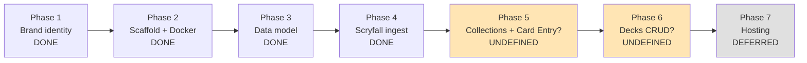

# Tutor — PM State Audit

## Table of Contents
- [Executive Summary](#executive-summary)
- [1. Roadmap State](#1-roadmap-state)
- [2. DECISIONS.md & Decision Capture](#2-decisionsmd--decision-capture)
- [3. Acceptance Criteria & Phase Sign-off](#3-acceptance-criteria--phase-sign-off)
- [4. Scope Health](#4-scope-health)
- [5. Specs & Planning Artifacts](#5-specs--planning-artifacts)
- [6. User/Stakeholder Clarity](#6-userstakeholder-clarity)
- [7. Recommendations Backlog (PM)](#7-recommendations-backlog-pm)

## Executive Summary

Tutor is four phases in (brand seed, brand finalize, scaffold + Rust/React + Docker Postgres, schema, Scryfall ingest) and the project is in genuinely good PM shape for a single-developer + agent setup. The charter is crisp, the V1 scope is locked and visible in two places (`tutor-pm` agent + `DECISIONS.md`), and the decision log is real, dated, and reasons-out alternatives. The weak spots are all artifacts of *future* discipline: there is no standing roadmap doc, no per-phase plan documents anywhere on disk, and no captured acceptance criteria or sign-off records for the four completed phases.

**Top 3 findings**
1. **Roadmap exists only in agent prompts and DECISIONS.md prose.** There is no `ROADMAP.md`, no `docs/roadmap/`, no `specs/`, and no per-phase plan files. The "Phase N → Phase N+1" boundary lives entirely in commit messages plus the V1.x list in the `tutor-pm` agent definition. This worked for Phases 1–4; it will not scale past V1.0 where dependencies get tangled (tagging → charts → KB → engine).
2. **No acceptance criteria captured for completed phases.** The charter mandates "testable bullets *before* any code is written" and "sign off before merging phase work." Neither survives as an artifact. The commit messages are good, but they're a substitute, not the thing itself. Next phase risk: scope drift on the first ambiguous deliverable.
3. **`DECISIONS.md` quality is high but coverage has gaps.** 11 entries, all from 2026-05-24, all well-formed. Missing: rationale for the codegen choice of `openapi-typescript` over `orval`, the Postgres port choice (55432), the choice to ingest `default_cards` rather than `all_cards`, the choice to not gitignore `Cargo.lock`, and explicit V1 acceptance for Phases 1–4 (a "Phase N closed: criteria met" entry).

**Top 5 recommendations (priority order)**
1. **Add `ROADMAP.md`** — single source of truth, phase boundaries, status column. (S)
2. **Backfill acceptance criteria for Phases 1–4** as a single closure document, mark them met, then adopt a per-phase plan template going forward. (S)
3. **Write the Phase 5 plan before any code lands** — this is the next phase trigger and it's currently undefined. Likely "Collections + Card Entry CRUD" but unconfirmed. (S)
4. **Define the V1.0 cut line explicitly** — which of the locked V1 items are remaining (collections CRUD, card entry, decks CRUD, gallery, deck views, theming) and in what phase order. (S)
5. **Create `docs/phases/` with a one-pager per phase** (objectives, deliverables, acceptance criteria, agent assignments, risks, status). (M)

### Next Steps
Coordinator: tutor-pm (this agent), feeding into the project-wide recommendation backlog being assembled at `/home/mantis/Development/mantis-dev/tutor/tmp/mux/20260524-1632-tutor-project-review-backlog/`. This report lives at `/home/mantis/Development/mantis-dev/tutor/tmp/mux/20260524-1632-tutor-project-review-backlog/audit/001-project-pm-state.md`.

---

## 1. Roadmap State

**Artifacts found.** None of: `ROADMAP.md`, `docs/`, `docs/roadmap/`, `specs/`, `plans/`, `planning/`, `PHASE*.md`. The only roadmap-shaped text on disk is:
- The "V1 scope (locked)" + "NOT in V1 (roadmap)" sections of `.claude/agents/tutor-pm.md`.
- The V1.x → V2.x sequence in `DECISIONS.md` line 24.
- Commit messages naming Phases 1–4.

**Phase numbering — reconstructed from commits + scattered references**

**Phase boundary crispness.** Phases 1–4 have crisp commit-level boundaries. Phases 5+ are not numbered, scoped, or sequenced anywhere on disk. The V1 charter lists what must be in V1; it does *not* say which phases deliver which items, in what order, or with what dependency chain.

**Implication.** A naive read of remaining V1 ("collections CRUD, card entry, decks CRUD, gallery, deck views, theming, one-command local dev") suggests 2–4 more phases. None are sequenced. The next phase plan does not yet exist.

## 2. DECISIONS.md & Decision Capture

**Exists, well-maintained.** 96 lines, 11 entries, all dated 2026-05-24 (which is correct — this is a fresh project). Format is consistent: `## YYYY-MM-DD — Title`, then prose, then "Alternatives considered" where relevant. The author follows their own format from the agent charter ("date, decision, reason, alternatives considered, who decided") loosely — the "who decided" field is implicit (user / agent owner) and only sometimes stated.

**Decision quality.** Strong on rationale. Strong on alternatives. The data-model decision (line 81–91) is exemplary: lists 6 sub-decisions, names the trade-off on each. The brand direction decision (73–79) explicitly names runners-up and why each lost. The stack decisions (30–53) cite alternatives by name.

**Gaps identified.**
- **Codegen tool.** Mentions `openapi-typescript` and `utoipa` but no entry explains why `openapi-typescript` over `orval`, `openapi-fetch`, or `kubb`.
- **Postgres port 55432.** Documented in README but not in DECISIONS — non-obvious because most projects use 5432.
- **Ingest source choice.** `default_cards` was chosen over `all_cards` (English only vs. every printing in every language); this is a real product trade-off and is not logged.
- **`Cargo.lock` tracked.** Worth a one-liner — the convention for binaries vs. libraries is non-obvious.
- **Phase closure entries missing.** No "Phase 1 closed — acceptance criteria met" entries. The log captures *what was decided to do*, not *what was accepted as done*. The PM charter conflates the two; in practice they want both.
- **"Who decided"** field is uneven — DECISIONS.md template suggests it but most entries omit it.

**Maintenance risk.** All 11 entries are from a single day. The first real test of decision-log discipline is whether Phase 5 gets new entries before code lands.

## 3. Acceptance Criteria & Phase Sign-off

**Charter says.** From `tutor-pm.md` line 13: "Define acceptance criteria for each phase as testable bullets *before* any code is written." And line 15: "Sign off before merging phase work."

**Reality.** Zero acceptance-criteria documents on disk. Zero sign-off records. Grep for "acceptance criteria" returns only the agent definitions themselves. The four completed phases shipped without leaving testable bullets behind. Verification happens at the commit-message level ("Phase 4 — Scryfall data sync pipeline") but the criteria that gated the merge are not preserved.

**What this costs.**
- Re-opening "is Phase 3 really done?" requires re-deriving criteria from migrations + DECISIONS.
- Phase boundaries get blurry when later phases discover schema gaps (e.g., if Phase 5 needs a column not in 0003–0005, was that an oversight or a Phase 5 deliverable?).
- The single-developer pattern hides this — the cost only materializes when another agent or a future-self reviews work.

**What's there that helps.**
- Migration filenames are numbered and titled.
- Commit messages are conventional and descriptive.
- The Makefile encodes some implicit acceptance criteria (`make test`, `make lint`, `make typecheck` all pass → "it works").
- `GET /api/health` returns row counts for sets/cards/printings — an implicit acceptance probe for Phase 4.

**Verdict.** The implicit signals are decent. The explicit artifact is missing. This is the single biggest PM gap.

## 4. Scope Health

**V1 scope is well-guarded.** Locked list in two places, "NOT in V1" list explicit, camera scanning explicitly punted to V2.0 with the trade-off named ("highest-risk feature in the original brief"). Effect-tag auto-derivation, KB seeding, deckbuilding engine, and Personalities are all sequenced V1.1 → V1.5. This is exemplary scope hygiene.

**Scope-creep signals observed.**
- **Phase 6 mentioned in DECISIONS without a Phase 5 mentioned anywhere.** The decision log refers to "our analyzer (Phase 6)" but Phase 5 is undefined. This is a smell — it suggests the PM has a mental model of the phase sequence that hasn't been written down, and that mental model is leaking into other artifacts.
- **`affects_board_on_cast` and `fetchable_land_types` already in the schema** but the analyzer that populates them is Phase 6 work (V1.1 territory). This is fine *because* the PM explicitly chose "schema is cheap to design once" — but it does mean Phase 3 included future-V1.1 columns. The risk: similar premature schema decisions later that *don't* get justified.
- **`card_effect_tags` / `card_functional_roles` tables in 0005** exist before the taxonomy is defined (tutor-mtg-expert's domain). The schema has a `source` and `confidence` shape that bakes in assumptions about how tagging will work. Reasonable, but currently uncoupled from a written taxonomy.

**What's blocking the next phase.**
- No phase plan written.
- No acceptance criteria.
- Ambiguity about whether collections-CRUD or card-entry-UX comes first.
- Ambiguity about whether the next phase ships a UI screen or just the API.
- Hosting (Phase 7) explicitly deferred, which is correct.

## 5. Specs & Planning Artifacts

**No `specs/` directory. No `docs/`. No `plans/`.** Only `branding/brief.md` (a finished deliverable, not a spec) and the agent definitions.

**No per-feature specs.** Card search, ingest, schema — all shipped without a written spec. The agent-driven workflow ("plan → approval → implement → verify") is described in the charter, but the *plans* don't survive as artifacts. They presumably lived in chat threads.

**Risk.** The four phases shipped fast because they're well-bounded greenfield infrastructure. The next phases (collections, card entry, decks UI) are where ambiguity bites — these are the first user-facing features with real product decisions (e.g., what does "paste-list bulk import" actually parse? MTGO format? Arena format? plain names? names+sets?). Without specs, those decisions ship in code and are then expensive to revisit.

## 6. User/Stakeholder Clarity

**User is well-defined.**
- README line 12–16: "the differentiators" — clear positioning.
- `tutor-pm.md` opening: "single sealed-league / Commander player (with multi-user as a future possibility)" — specific.
- `tutor-brand-design.md`: "serious MTG players (sealed-league, Commander) who want a thinking partner, not a marketplace." Reinforced.
- `branding/brief.md`: "Audience" section names the user three different ways, all consistent. Anti-audience ("not new players. Not collectors-as-investors") is stated.

**Success criteria for V1.** Implicit but inferrable: a single user can ingest the Scryfall catalog, add cards with provenance to multiple collections, build decks with format/bracket/role, and view both in a calmly-designed UI. No quantified targets ("X cards/min entry," "Y deck rendering time"). Reasonable for a solo project; would matter more for multi-user.

**In-scope / out-of-scope clarity.** Excellent. The V1 / not-V1 split is one of the strongest PM artifacts in the project.

**Gaps.**
- No "personas" or "JTBD" framing — fine for a solo project, but worth noting if multi-user lands.
- No explicit "definition of done for V1" — the V1 list says what to build, not what shipping looks like (dogfooded by user X cards in collection? Y decks built? Z weeks of daily use?).
- No metric or qualitative bar for "brand identity is good enough" — Phase 1 closed on user judgment, which is correct, but doesn't bind future brand decisions.

## 7. Recommendations Backlog (PM)

Each item: **Title** — Why — Suggested phase/priority — Effort (S/M/L).

1. **Add `ROADMAP.md` at project root** — Single source of truth for phase sequence + status. Currently the roadmap lives in three half-overlapping places (agent prompt, DECISIONS.md, commit history). Pulls them into one file the user and every agent can reference. — Phase 5 prep / P0 — S

2. **Write a Phase 5 plan before any code lands** — Phase 5 is the first phase where what-to-build is genuinely ambiguous (collections vs. card entry vs. minimal UI shell). Without a written plan, the charter's "plan → approval → implement" loop breaks. Plan should include: objectives, deliverables, acceptance criteria, agent assignments, risks. — Phase 5 prep / P0 — S

3. **Backfill acceptance criteria + sign-off for Phases 1–4** — As a single retroactive doc (`docs/phases/closure-p1-p4.md` or appended to DECISIONS as four "Phase N closed" entries). Makes the "is Phase 3 done?" question answerable without re-reading code. — Phase 5 prep / P0 — S

4. **Create `docs/phases/` with a one-pager-per-phase template** — Forces the discipline going forward. Template: objectives, deliverables (checklist), acceptance criteria (testable bullets), agent assignments, risks + mitigations, status. — Phase 5 prep / P1 — M

5. **Define the V1.0 cut line explicitly** — Map each remaining V1 scope item to a phase. Right now we know V1.0 contains "collections CRUD, card entry, decks CRUD, gallery, deck views, theming," but not which phase ships which. Likely 3 phases (5: Collections + Entry, 6: Decks, 7: Gallery/Polish/Theme), but unconfirmed. — Phase 5 prep / P1 — S

6. **Add a "Phase closure" convention to DECISIONS.md** — One entry per closed phase: "Phase N closed — acceptance criteria met: [list], known gaps deferred: [list]." Makes the decision log a project chronicle, not just a choice log. — Phase 5 prep / P1 — S

7. **Backfill missing decisions in DECISIONS.md** — Specifically: `openapi-typescript` choice, Postgres port 55432, `default_cards` vs `all_cards` ingest scope, `Cargo.lock` tracked, premature schema columns (`affects_board_on_cast`, `fetchable_land_types`). Each entry can be 2–4 lines. — Phase 5 prep / P2 — S

8. **Write a "definition of done for V1.0"** — Beyond the feature list, what does shipped V1.0 look like for a solo user? Suggested: dogfooded by user with their actual sealed-league pool for 2+ weeks, at least 3 real Commander decks built in-app, no daily-use friction blockers. Or whatever bar the user actually wants. — Phase 5 prep / P2 — S

9. **Loop tutor-mtg-expert into the next schema-touching phase before code** — `card_effect_tags` / `card_functional_roles` shipped before the taxonomy was written. That's fine for the table shape but it bakes assumptions. Before V1.1's tagger lands, the taxonomy needs to exist as a document the schema can be validated against. — Phase 5 or before V1.1 / P1 — M

10. **Decide and document the bulk-import format(s) before Phase 5 starts** — "Paste-list bulk import" is in V1 scope but the format is unspecified. MTGO `.dec`? Arena `.txt`? Tappedout? Plain names? Names + set + collector number? Decision affects parser complexity, error UX, and round-trip. — Phase 5 prep / P1 — S

11. **Define dogfooding milestones tied to phase exits** — Phase 5 exit = user can enter their actual physical sealed pool. Phase 6 exit = user can build a real Commander deck against that pool. Phase 7 exit = the UI is calm enough that the user wants to use it daily. Anchors phase definitions to user outcomes rather than feature lists. — Phase 5 prep / P2 — S

12. **Add a `STATUS.md` or top-of-README status block** — A single line on the README + a status section tracking which phase is active, which is next, what's blocked. Replaces the current "Phase 2 scaffold" line which is already stale (Phases 3 and 4 are done). — Phase 5 prep / P2 — S

13. **Establish a written "phase exit checklist"** — Standard checklist every phase must pass before sign-off: acceptance criteria met, decisions logged, README status updated, CI green, ROADMAP advanced, any deferred items captured in next-phase plan. Makes phase boundaries enforceable. — Phase 5 prep / P1 — S

14. **Capture user research / dogfooding notes in a structured file** — Even for a solo user, recording "tried bulk import on my pool of N cards, hit X friction" makes the V1.1+ priorities defensible. Suggest `docs/dogfooding.md` or session notes per dogfooding pass. — Phase 6+ / P3 — S

15. **Pre-write the V1.1 (effect-tag auto-derivation) scope brief** — Currently V1.1 is one bullet point. The schema bakes in the shape (`source`, `confidence`). Before V1.0 ships, the V1.1 brief should at least name the first 10 tags to auto-derive, the data sources (oracle text + Scryfall keywords), and the acceptance bar. Otherwise V1.0 risks shipping with the tagger team blocked. — End of V1.0 / P2 — M

---

*Audit complete. 15 recommendations, weighted toward Phase 5 readiness. The project is in a strong PM state for a phase 1–4 fresh build; the gaps are all about transitioning from "fast greenfield" to "sustainable phase cadence." None of the gaps are blockers — but addressing items 1–3 before any Phase 5 code lands would prevent the most likely failure mode (scope drift on first user-facing feature).*
